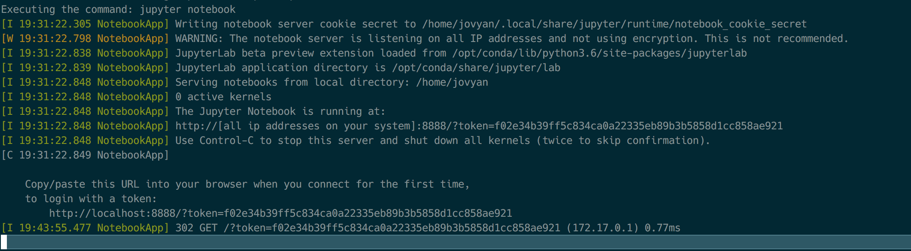

# BTC Challenge

## Let's Crack This Code!
But really, I'm hanging out with my kid today--so I'm donating my efforts and tools to the community.
If you find this useful, you can send tips here:

- BTC: 3NEXPQyiB1M8nGqHizWrFPWodFXBkKRUcn
- ETH: 0x5CBC8132e7bb0A5532D3aA8c96Eb18F3bb4F7a48
- Token Friendly ETH: 0xa0a31ee59682638cd2c0295fd47c40f8117c33eb
- LTC: MMoNAyPAQpxvmzvkKBA1hP5GjZA4EpDEBr
- BCH: qp86ykx7psftpny88ytttdxlzgsdslavyud2xcm0cf

> (I'll take anything \\[^_^]/

This repo contains a playground for executable code using [Jupyter notebooks](https://jupyter.org/). You can run this project and all samples in a Docker container locally, or using https://mybinder.org/ 

[Click to Launch Notebook on MyBinder](https://mybinder.org/v2/gh/atomantic/btc_challenge/master)

## Getting Started (Locally)

> Note: If you are running Windows and you are running < Windows 10 (e.g. Windows 7), you will need to use [MyBinder](https://mybinder.org/). Enter `https://github.com/atomantic/btc_challenge` as the `Github Repo` and click `launch`

Below are instructions for setting up your local machine as a sandbox for the workshop. Once you complete these steps
you'll have a working, local deployment of the jupter environment running on your host within a docker container.

1. Install Docker for [Mac](https://www.docker.com/docker-mac) / [Linux](https://docs.docker.com/install/) / [Windows 10](https://docs.docker.com/docker-for-windows/install/#download-docker-for-windows)
2. Start docker ;)
3. Clone and start the project

- **MacOS / Linux**
```shell
git clone https://github.com/atomantic/btc_challenge.git
cd btc_challenge
docker run -it -v $(pwd):/home/jovyan --rm -p 8888:8888 jupyter/scipy-notebook
```

- **Windows 10**
> recommend using [bash for windows](https://docs.microsoft.com/en-us/windows/wsl/install-win10) or [Cygwin](https://www.cygwin.com/) then follow the same instructions for Mac/Linux :)

4. Open the link to jupyter environment given by the docker run command (e.g. http://localhost:8888/?token=f02e34b39ff5c834ca0a22335eb89b3b5858d1cc858ae921) 